# 📊 Superstore Sales Intelligence Dashboard
## Google Sheets Portfolio Project

---

## 📌 Project Overview

An interactive sales analytics dashboard built entirely in
free Google Sheets analyzing 9,994 retail orders across
4 years (2014–2017) with dynamic filtering and scenario
analysis.

---

## 📊 Dataset Summary

| Property | Value |
|---|---|
| Source | Kaggle — Sample Superstore |
| Records | 9,994 orders |
| Period | 2014 – 2017 |
| Categories | Furniture, Office Supplies, Technology |
| Regions | West, East, Central, South |
| Segments | Consumer, Corporate, Home Office |

## 💰 Key Metrics

| Metric | Value |
|---|---|
| Total Revenue | $2,297,201 |
| Total Profit | $286,397 |
| Profit Margin | 12.47% |
| Total Orders | 9,994 |
| Avg Order Value | $230 |

---

## 🗂️ Sheet Structure

| Sheet | Description |
|---|---|
| Cover | Project overview and navigation |
| Raw Data | 9,994 rows with conditional formatting |
| Summary | SUMIF, COUNTIF, INDEX MATCH formulas |
| Pivot Tables | 5 pivot tables with color coded headings |
| Charts | 8 charts including scatter, donut, sparklines |
| Dashboard | Interactive dashboard with 4 dropdown filters |
| What-If | 6 business scenario analysis tables |

---
## 📸 Project Screenshots

### 🏠 Cover Page
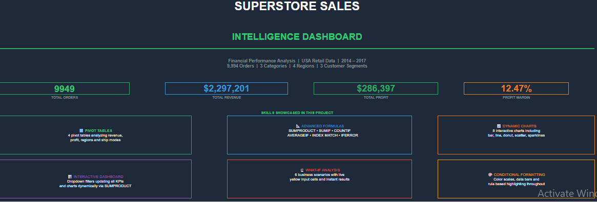

### 📊 Interactive Dashboard
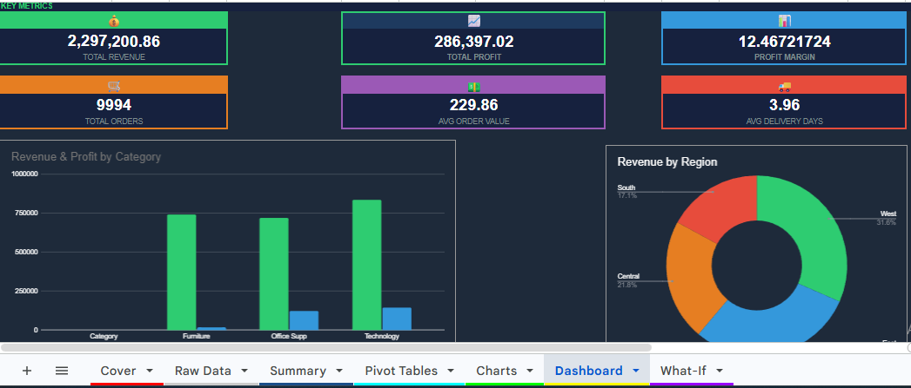
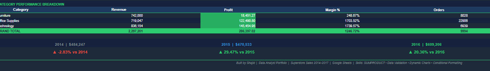

### 📁 Raw Data with Conditional Formatting
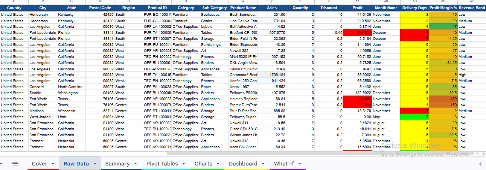

### 📋 Summary Formulas
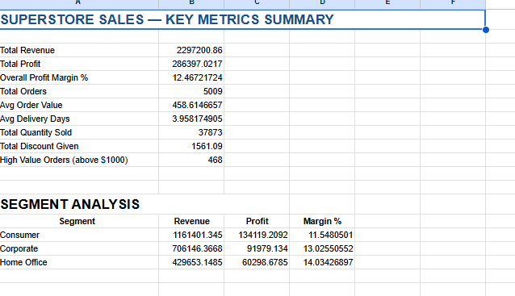
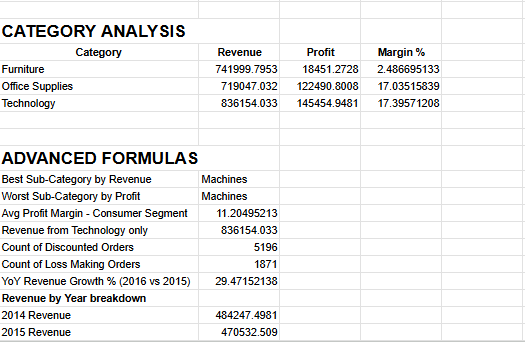

### 🔢 Pivot Tables
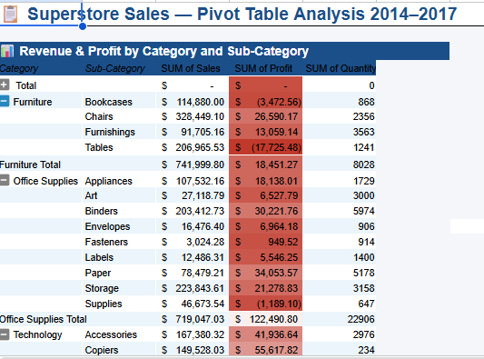
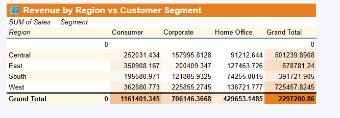
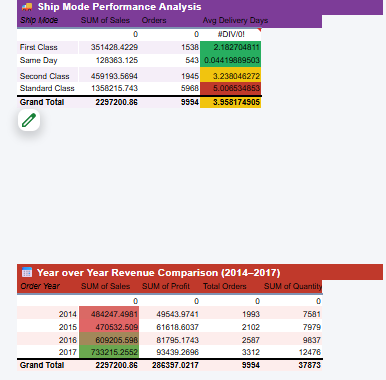

### 📈 Charts
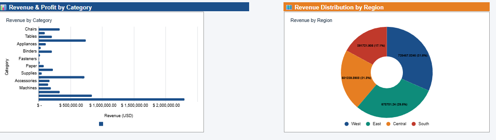
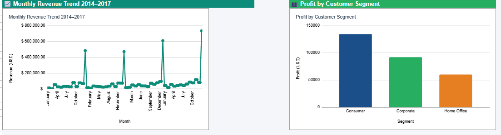
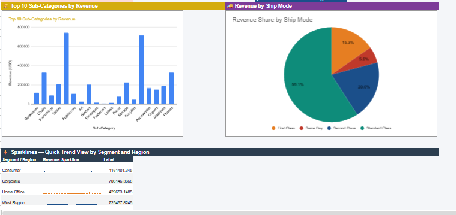

### 🔮 What-If Scenario Analysis
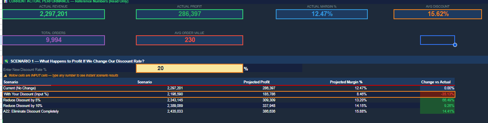
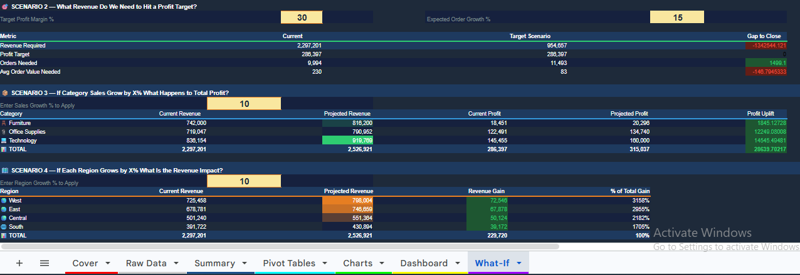
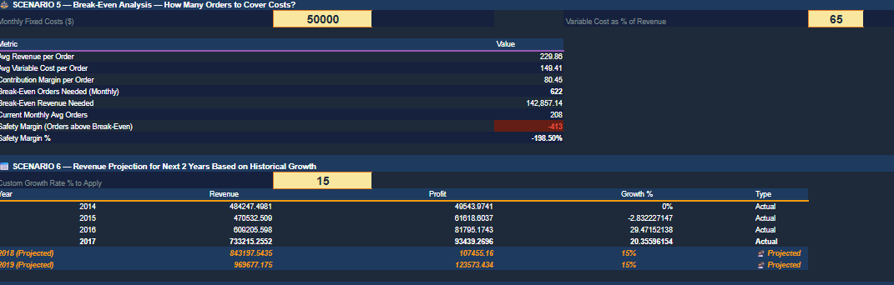
---

## ✅ Excel Skills Demonstrated

| Skill | Where Used |
|---|---|
| SUMPRODUCT | Dashboard dynamic KPIs |
| SUMIF / SUMIFS | Summary and What-If sheets |
| COUNTIF / AVERAGEIF | Summary formulas |
| INDEX MATCH | Advanced formula sheet |
| Pivot Tables | 5 pivot tables |
| Dynamic Charts | 8 chart types |
| Conditional Formatting | Raw data highlighting |
| Color Scales | What-If sensitivity tables |
| Sparklines | Summary trend indicators |
| Data Validation | Dashboard dropdown filters |
| What-If Scenarios | 6 business scenarios |
| Named Ranges | Input cell references |
| Navigation Buttons | 4 sheets |
| Dashboard Design | Full dark theme |

---

## 🔗 Live Project

👉 [Open Interactive Dashboard] (https://docs.google.com/spreadsheets/d/14WSm68rPm3IzsH-mMH0eWjvtCKdWvVnBbD5Sve7H_Bo/edit?usp=sharing)

---

## 👤 Author

**Shajid**
Accounting Professional Transitioning to Data Analytics
Skills: SQL • Python • Power BI • Machine Learning • Google Sheets

